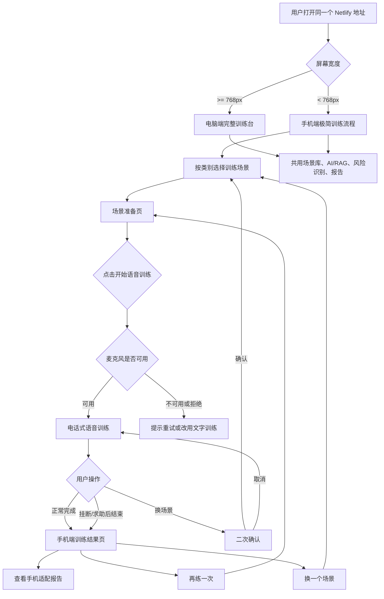
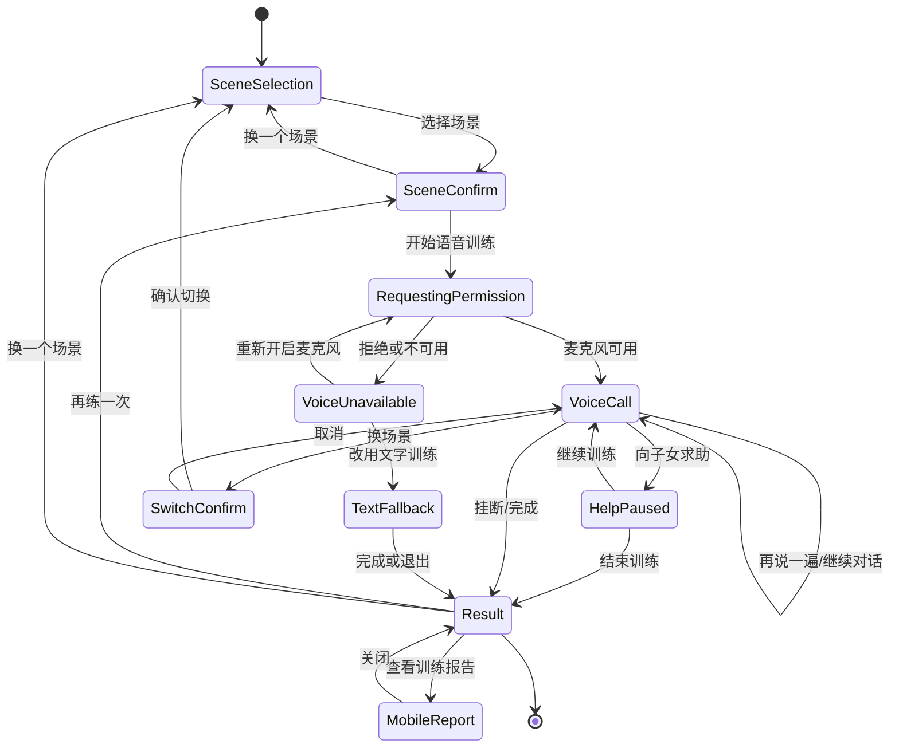

# 产品需求文档：银龄反诈手机端老年人极简语音训练 UI - V1

## 1. 综述

### 1.1 项目背景与核心问题

OldCheat 当前已经具备 Next.js 训练台、动态场景库、DeepSeek 对话生成、RAG 检索、风险识别、训练报告和语音训练能力。现有电脑端三栏训练台适合开发、答辩和功能演示，但对真实老年用户来说信息密度偏高，文字较多，按钮较小，使用门槛仍然偏高。

本需求目标是在同一个 Netlify 线上地址下新增手机端老年人极简语音训练 UI：电脑端继续显示现有完整训练台，手机端自动显示更接近“接电话”的简化流程。老人打开手机网页后，先选择训练场景，再点击大号“开始语音训练”，之后主要通过听和说完成训练。手机端必须保留场景选择切换、语音通话、求助、挂断、训练结果和报告入口，同时继续复用现有场景库、AI/RAG、风险识别和报告能力。

本 PRD 不要求重写现有电脑端训练台，也不要求新增第二个网址。手机端是现有训练系统的响应式体验层和交互重组，不是独立业务系统。

### 1.2 用户旅程地图

1. **选择训练场景** - 用户在手机端按类别浏览完整诈骗场景，高风险场景优先展示，并可在训练中二次确认后切换场景。
2. **确认场景并开始训练** - 用户进入准备页，确认来电身份和核心提醒，点击大号按钮开始语音训练。
3. **进行电话式语音训练** - 用户在极简通话界面中听诈骗方说话，自己开口回答，并可再说一遍、求助、挂断或换场景。
4. **结束训练并查看结果** - 用户完成或中途挂断后进入简版结果页，可查看手机适配报告、再练一次或换场景。
5. **响应式分流与兼容** - 同一网址根据屏幕宽度展示电脑端或手机端，两端共用数据和后端能力，互不破坏。

### 1.3 核心用户流程



### 1.4 手机端训练状态机



## 2. 用户故事详述

### 阶段一：选择训练场景

#### US-01：作为老年用户，我希望能在手机端清楚选择或切换训练场景，以便按自己想练的骗局开始训练

**价值陈述**

- **作为** 老年用户或辅助演示者
- **我希望** 在手机端看到完整、分组、易点选的诈骗训练场景
- **以便** 不依赖电脑端三栏界面，也能选择不同骗局进行语音训练

**业务规则与逻辑**

1. 手机端进入训练时，默认先展示场景选择页。
2. 场景数据来自现有动态场景库，必须支持当前完整 14 个场景，并能随数据源扩展。
3. 场景按类别分组展示，组内高风险优先。
4. 推荐分组：
   - 冒充身份与账户：SC-01 冒充公检法、SC-10 虚假征信修复、SC-11 医保社保诈骗、SC-13 银行账户异常诈骗。
   - 熟人求助与紧急事件：SC-06 冒充子女、SC-12 冒充熟人借钱、SC-14 绑架勒索诈骗。
   - 赚钱、贷款与中奖：SC-02 投资理财诈骗、SC-03 网络刷单诈骗、SC-09 虚假贷款诈骗、SC-05 虚假中奖。
   - 生活服务与健康：SC-04 保健品骗局、SC-07 物流快递诈骗、SC-08 冒充客服退款。
5. 每个场景卡片显示：诈骗类别、来电身份、风险等级、1 句场景摘要。
6. 点击场景卡片后不直接开始通话，而是进入场景确认页。
7. 训练中点击“换场景”时必须二次确认。
8. 二次确认文案：`切换场景将结束本次训练，已有记录会保留。是否继续？`
9. 确认切换后停止当前语音播放与识别，保留已有训练记录，返回场景选择页。
10. 取消切换后回到原通话状态。
11. 动态场景库加载失败时，手机端使用静态 fallback 场景，页面不能空白。

**页面布局线框图**

```text
+--------------------------------+
| 银龄反诈训练                    |
| 选择一个训练场景                |
+--------------------------------+
| 高风险优先                      |
|                                |
| 冒充身份与账户                  |
| +----------------------------+ |
| | 冒充公检法              高 | |
| | 「公安机关」来电             | |
| | 声称涉案，要求资金清查        | |
| +----------------------------+ |
| +----------------------------+ |
| | 银行账户异常诈骗        高 | |
| | 银行客服 · 风控专员          | |
| +----------------------------+ |
|                                |
| 熟人求助与紧急事件              |
| +----------------------------+ |
| | 冒充子女                高 | |
| | 「女儿」小雪                 | |
| +----------------------------+ |
|                                |
| 生活服务与健康                  |
| +----------------------------+ |
| | 保健品骗局              中 | |
| | 健康顾问 · 陈主任            | |
| +----------------------------+ |
+--------------------------------+
```

**验收标准**

- **GIVEN** 用户用手机宽度打开网页，**WHEN** 场景库加载成功，**THEN** 页面展示完整 14 个场景并按类别分组。
- **GIVEN** 用户点击任意场景，**WHEN** 场景被选中，**THEN** 页面进入该场景的准备页，而不是直接开始通话。
- **GIVEN** 用户正在语音训练，**WHEN** 点击“换场景”，**THEN** 系统展示二次确认。
- **GIVEN** 用户确认切换，**WHEN** 当前训练被结束，**THEN** 系统停止语音、保留记录并返回场景选择页。
- **GIVEN** 动态场景库加载失败，**WHEN** 手机端初始化，**THEN** 使用静态 fallback 场景，不出现白屏。

### 阶段二：确认场景并开始训练

#### US-02：作为老年用户，我希望开始前先看到简短确认页，以便知道这通模拟电话是谁打来的

**价值陈述**

- **作为** 老年用户
- **我希望** 在开始训练前看到清楚的来电身份和一句防骗提醒
- **以便** 不被复杂说明打断，也能放心点击开始

**业务规则与逻辑**

1. 用户选择场景后进入手机端准备页。
2. 页面展示场景名称、来电身份、风险等级和 1 句核心提醒。
3. 准备页不展示完整话术分析，不出现大段说明。
4. 主按钮为大号 `开始语音训练`，高度 64-72px，宽度接近占满容器。
5. 主按钮字号 20-22px，并搭配电话或麦克风图标。
6. 点击 `开始语音训练` 后才请求麦克风权限，不在页面加载时请求。
7. 页面提供次级入口：`换一个场景`、`改用文字训练`。
8. 若用户拒绝麦克风权限，进入麦克风异常页。
9. 麦克风异常页主按钮为大号 `重新开启麦克风`，同样高度 64-72px。
10. 麦克风异常页还提供 `改用文字训练`、`返回选场景`。
11. 手机端准备页视觉风格必须与电脑端保持一致：青绿色主色、浅色背景、风险色、圆角卡片、lucide 图标体系。
12. 手机端只改变信息密度和控件尺寸，不另做割裂的视觉风格。

**页面布局线框图**

```text
+--------------------------------+
| 银龄反诈训练                    |
| 准备开始一通模拟电话            |
+--------------------------------+
|                                |
| +----------------------------+ |
| | 冒充子女 · 小雪              | |
| | 高风险                       | |
| | 先别转账，先核实身份          | |
| +----------------------------+ |
|                                |
| +----------------------------+ |
| | 电话图标                     | |
| | 开始语音训练                 | |
| +----------------------------+ |
|                                |
|       换一个场景                |
|       改用文字训练              |
+--------------------------------+
```

**麦克风异常线框图**

```text
+--------------------------------+
| 没有打开麦克风                  |
+--------------------------------+
| 需要麦克风才能语音训练。         |
| 你也可以继续用文字训练。         |
|                                |
| +----------------------------+ |
| | 麦克风图标                   | |
| | 重新开启麦克风               | |
| +----------------------------+ |
|                                |
|       改用文字训练              |
|       返回选场景                |
+--------------------------------+
```

**验收标准**

- **GIVEN** 用户选择场景，**WHEN** 进入准备页，**THEN** 页面正确显示场景、来电身份、风险等级和核心提醒。
- **GIVEN** 用户未点击开始，**WHEN** 准备页加载，**THEN** 浏览器不请求麦克风权限。
- **GIVEN** 用户点击开始，**WHEN** 浏览器弹出麦克风权限，**THEN** 系统等待用户授权。
- **GIVEN** 用户拒绝麦克风，**WHEN** 权限请求失败，**THEN** 页面显示大号“重新开启麦克风”并保留文字训练入口。
- **GIVEN** 用户在电脑端打开页面，**WHEN** 宽度大于等于 768px，**THEN** 不进入手机准备页，继续显示现有完整训练台。

### 阶段三：进行电话式语音训练

#### US-03：作为老年用户，我希望手机端像接电话一样训练，以便主要靠听和说完成反诈练习

**价值陈述**

- **作为** 老年用户
- **我希望** 页面像电话一样显示“对方正在说话”“请你回答”
- **以便** 不需要阅读复杂聊天记录，也能完成训练

**业务规则与逻辑**

1. 用户点击开始并授权麦克风后，进入电话式语音训练页。
2. 页面显示当前场景、来电身份、通话计时和当前状态。
3. 核心状态短句包括：
   - `对方正在说话`
   - `请你回答`
   - `正在识别`
   - `正在思考`
   - `没听清，请再说一遍`
   - `训练完成`
4. 优先使用现有阿里云实时语音能力；不可用时退回浏览器语音或文字训练。
5. 用户语音识别出的文字仍提交到现有 `/api/training-chat` 链路。
6. 手机端继续保留 DeepSeek、RAG、Ollama、本地场景库兜底能力。
7. 对话文字作为字幕保留，但视觉上弱化，不作为老人必须阅读的主内容。
8. 页面必须保留大号操作按钮：
   - `再说一遍`
   - `向子女求助`
   - `挂断/退出`
   - `换场景`
9. `再说一遍` 重播上一句诈骗方话术。
10. `向子女求助` 触发现有求助逻辑，记录为正确应对，可继续训练或结束。
11. `挂断/退出` 立即停止 ASR、TTS、音频播放和计时，并进入结果页。
12. `换场景` 必须二次确认。
13. 诈骗方文本中用于提示语气的括号内容不能机械朗读。例如 `(语气急切)`、`（语气严肃）` 不应进入可听语音。
14. 如果当前语音服务支持语气控制，则将常见提示映射为语音参数；如果不支持，则仅清洗掉括号提示。
15. 手机端整体风格继续沿用电脑端视觉体系，但按钮更大、信息更少。

**页面布局线框图**

```text
+--------------------------------+
| 银龄反诈训练              03:21 |
| 冒充子女 · 小雪                 |
+--------------------------------+
|                                |
|        来电人头像/图标           |
|                                |
|        对方正在说话              |
|     先听完，不要转账             |
|                                |
| +----------------------------+ |
| | 字幕：妈，我手机摔坏了，       | |
| | 这是临时号码……               | |
| +----------------------------+ |
|                                |
+--------------------------------+
| 风险等级：高                    |
| 当前提醒：先核实身份             |
+--------------------------------+
| +------------+ +------------+   |
| | 再说一遍   | | 向子女求助 |   |
| +------------+ +------------+   |
|                                |
| +----------------------------+ |
| |          挂断/退出           | |
| +----------------------------+ |
|                                |
|          换场景                 |
+--------------------------------+
```

**用户回答状态线框图**

```text
+--------------------------------+
| 银龄反诈训练              03:42 |
| 冒充子女 · 小雪                 |
+--------------------------------+
|                                |
|          麦克风动效             |
|                                |
|          请你回答               |
|        可以直接开口说            |
|                                |
| 识别中：你是谁？我先打原来的     |
| 电话确认一下。                  |
|                                |
+--------------------------------+
| +------------+ +------------+   |
| | 再说一遍   | | 向子女求助 |   |
| +------------+ +------------+   |
| +----------------------------+ |
| |          挂断/退出           | |
| +----------------------------+ |
+--------------------------------+
```

**换场景确认线框图**

```text
+--------------------------------+
| 要换一个训练场景吗？             |
+--------------------------------+
| 当前这场训练会结束，记录会保留。 |
|                                |
| +----------------------------+ |
| |        继续换场景            | |
| +----------------------------+ |
|                                |
|        取消，继续训练            |
+--------------------------------+
```

**验收标准**

- **GIVEN** 用户进入手机端语音训练，**WHEN** 对方话术播放，**THEN** 页面显示“对方正在说话”并朗读诈骗方内容。
- **GIVEN** 对方话术播放结束，**WHEN** 用户开始说话，**THEN** 页面显示“请你回答”或“正在识别”并生成字幕。
- **GIVEN** 用户回答被识别，**WHEN** 识别结果提交，**THEN** 系统继续调用现有训练对话链路。
- **GIVEN** 诈骗方文本包含语气括号，**WHEN** 语音播放，**THEN** 括号提示不被朗读。
- **GIVEN** 用户点击“再说一遍”，**WHEN** 当前有上一句诈骗方话术，**THEN** 系统重播上一句。
- **GIVEN** 用户点击“向子女求助”，**WHEN** 求助逻辑触发，**THEN** 系统记录正确应对并给出安全提示。
- **GIVEN** 用户点击“挂断/退出”，**WHEN** 系统结束训练，**THEN** 语音采集和播放立即停止。
- **GIVEN** 语音服务不可用，**WHEN** 用户继续训练，**THEN** 页面可退回浏览器语音或文字训练，不白屏。

### 阶段四：结束训练并查看结果

#### US-04：作为老年用户，我希望训练结束后先看到简单结果，以便知道这次表现如何

**价值陈述**

- **作为** 老年用户
- **我希望** 挂断或完成训练后先看到简单易懂的结果
- **以便** 不被复杂报告吓到，也能知道自己做得对不对

**业务规则与逻辑**

1. 训练结束来源包括：完成全部轮次、用户点击挂断/退出、用户向子女求助后选择结束、系统异常但已有训练记录。
2. 结束后进入手机端结果页，不直接弹出电脑端复杂报告。
3. 结果页显示简版结果：防御分、风险等级、正确应对次数、风险动作次数、最需要记住的一句话。
4. 页面提供大号按钮：`查看训练报告`、`再练一次`、`换一个场景`。
5. `查看训练报告` 打开手机适配报告，先显示结论，再显示细节。
6. 手机端报告复用现有报告数据：对话轮次、心理弱点、风险动作、正确应对、DeepSeek 总结。
7. 中途挂断也生成阶段性报告，不能因为未完成全部轮次就没有结果。
8. 对话记录过少时显示 `训练记录较少`，但仍给基础建议。
9. `再练一次` 使用同一场景重新开始。
10. `换一个场景` 返回手机端场景选择页。
11. 手机端报告风格与电脑端一致，但信息密度更低，文字更短，按钮更大。

**结束页线框图**

```text
+--------------------------------+
| 本次训练结束                    |
| 冒充子女 · 小雪                 |
+--------------------------------+
|                                |
|        防御分  82               |
|        表现：较稳               |
|                                |
| 正确应对 3 次                   |
| 风险动作 1 次                   |
| 风险等级 中                     |
|                                |
+--------------------------------+
| 记住这一句：                    |
| 转账前，先打原来的电话确认       |
+--------------------------------+
| +----------------------------+ |
| |        查看训练报告          | |
| +----------------------------+ |
|                                |
| +----------------------------+ |
| |          再练一次            | |
| +----------------------------+ |
|                                |
|        换一个场景               |
+--------------------------------+
```

**手机报告线框图**

```text
+--------------------------------+
| 训练报告                  关闭 |
+--------------------------------+
| 综合结果：较稳                  |
| 防御分：82 / 100                |
+--------------------------------+
| 你做对了：                      |
| 1. 没有直接转账                 |
| 2. 提到要联系家人核实            |
+--------------------------------+
| 下次注意：                      |
| 1. 不要透露验证码               |
| 2. 对方催促时先挂断              |
+--------------------------------+
| 本场出现的话术：                |
| 紧急情况 / 冒充亲人 / 催促       |
+--------------------------------+
| +----------------------------+ |
| |          再练一次            | |
| +----------------------------+ |
+--------------------------------+
```

**异常结果线框图**

```text
+--------------------------------+
| 训练已保存                      |
+--------------------------------+
| 刚才语音有点不稳定，但已经保存   |
| 你完成的训练记录。              |
|                                |
| +----------------------------+ |
| |        查看已有结果          | |
| +----------------------------+ |
|                                |
|        换一个场景               |
+--------------------------------+
```

**验收标准**

- **GIVEN** 用户完成训练，**WHEN** 训练结束，**THEN** 页面进入手机端结果页。
- **GIVEN** 用户中途挂断，**WHEN** 已有训练记录，**THEN** 系统生成阶段性结果。
- **GIVEN** 用户点击查看训练报告，**WHEN** 报告打开，**THEN** 优先显示结论和简短建议。
- **GIVEN** 训练记录少于 2 轮，**WHEN** 打开报告，**THEN** 页面提示训练记录较少并给基础建议。
- **GIVEN** 用户点击再练一次，**WHEN** 新训练开始，**THEN** 使用同一场景重新进入准备页。
- **GIVEN** 用户点击换一个场景，**WHEN** 操作执行，**THEN** 回到手机端场景选择页。

### 阶段五：响应式分流与兼容

#### US-05：作为系统维护者，我希望同一网址自动适配电脑和手机，以便线上演示稳定且不破坏现有功能

**价值陈述**

- **作为** 系统维护者和项目答辩者
- **我希望** 同一个网址在电脑端和手机端显示不同但一致的体验
- **以便** 电脑端用于答辩展示，手机端用于老人实际操作，两者共用同一套训练能力

**业务规则与逻辑**

1. 使用同一个 Netlify 地址，不新增第二个网址。
2. 根据屏幕宽度进行 UI 分流：`>= 768px` 显示现有电脑端完整训练台，`< 768px` 显示手机端极简语音训练流程。
3. 不使用浏览器 UA 作为主要判断依据，避免平板、折叠屏、桌面缩放误判。
4. 手机端和电脑端共用同一份动态场景库。
5. 手机端必须支持当前完整 14 个场景，并可随数据源扩展。
6. 手机端和电脑端共用 `/api/training-chat`。
7. 手机端继续保留 DeepSeek、RAG、Ollama、本地场景库兜底链路。
8. 手机端语音失败时允许退回文字训练。
9. 电脑端现有三栏布局、场景选择、对话、报告和风险面板不做破坏性改动。
10. 手机端新增组件应复用现有训练状态和数据逻辑，不复制独立业务系统。
11. 手机端初始化失败时显示清晰错误页，不能白屏。
12. 如果动态场景库加载失败，手机端也要使用静态 fallback 场景。
13. 手机端和电脑端保持同一品牌风格：青绿色主色、浅色背景、风险色、lucide 图标体系、圆角卡片。
14. 手机端核心按钮点击区域足够大，主按钮高度 64-72px。
15. 手机端核心流程不能依赖横向滚动。

**响应式分流线框图**

```text
同一个 URL
https://oldcheat-training.netlify.app

        +----------------------+
        | 页面加载              |
        +----------+-----------+
                   |
             判断屏幕宽度
                   |
      +------------+------------+
      |                         |
  >= 768px                   < 768px
      |                         |
电脑完整训练台             手机极简语音训练
当前三栏 UI               场景选择 -> 准备 -> 通话 -> 结果
```

**验收标准**

- **GIVEN** 用户在电脑宽度打开页面，**WHEN** 页面加载，**THEN** 显示现有完整训练台。
- **GIVEN** 用户在手机宽度打开页面，**WHEN** 页面加载，**THEN** 显示手机端极简流程。
- **GIVEN** 手机端加载，**WHEN** 场景库可用，**THEN** 用户能看到完整 14 个场景。
- **GIVEN** 手机端训练完成，**WHEN** 查看报告，**THEN** 报告来自真实训练记录。
- **GIVEN** 电脑端使用现有训练流程，**WHEN** 手机端代码上线，**THEN** 电脑端场景选择、回复提交、风险面板和报告不退化。
- **GIVEN** Netlify 部署完成，**WHEN** 同一网址在手机和电脑分别访问，**THEN** 自动展示对应 UI。

## 3. 功能需求清单

### 3.1 必须实现

- 手机端响应式入口。
- 手机端完整 14 场景选择页。
- 场景类别分组与高风险优先排序。
- 训练中换场景二次确认。
- 手机端场景准备页。
- 大号 `开始语音训练` 和 `重新开启麦克风` 主按钮。
- 麦克风权限拒绝后的恢复与文字训练兜底。
- 电话式语音训练主界面。
- `再说一遍`、`向子女求助`、`挂断/退出`、`换场景`。
- 诈骗方括号语气提示清洗，不机械朗读。
- 手机端训练结束页。
- 手机适配版训练报告。
- 同一网址电脑/手机自动分流。
- 电脑端现有完整训练台不受影响。

### 3.2 不属于本版范围

- 新增第二个手机端网址。
- 真实拨打电话号码。
- WebRTC 多人通话。
- 长期保存原始音频。
- 重写电脑端三栏训练台。
- 为每个场景重新硬编码独立数据。
- 强制所有用户必须使用语音训练。

## 4. 交互与视觉约束

1. 手机端 UI 风格必须与电脑端一致，不做割裂的新品牌。
2. 主色继续使用当前训练台的青绿色体系。
3. 风险色继续沿用低、中、高风险颜色。
4. 图标优先使用 `lucide-react`。
5. 卡片圆角、边框、浅色背景与现有训练台保持一致。
6. 手机端减少文字密度，避免长段解释。
7. 主要操作按钮高度 64-72px，保证老年人易点击。
8. 次级操作也要有足够点击区域，不使用过小文字链接承载关键动作。
9. 页面文字不随 viewport 宽度线性缩放。
10. 核心内容不横向滚动。
11. 字幕可见但不抢占通话状态的主视觉。

## 5. 技术与接口约束

1. 手机端与电脑端共用现有场景加载逻辑，优先读取动态场景库，失败后 fallback。
2. 手机端与电脑端共用现有 `/api/training-chat` 对话接口。
3. 手机端语音训练复用现有 ASR/TTS 或实时语音能力。
4. 手机端不能暴露阿里云或 DeepSeek API key。
5. 语音不可用时退回浏览器语音或文字训练。
6. 训练记录、风险点、求助、挂断和报告数据应进入同一训练状态体系。
7. 手机端新增组件应围绕现有训练状态拆分，不另起一套独立状态机导致数据不一致。
8. 生产构建必须通过，Netlify 部署不能因为响应式逻辑失败。

## 6. 测试计划

### 6.1 手机端功能测试

- 手机宽度打开页面，默认进入手机端场景选择页。
- 场景选择页展示完整 14 个场景。
- 每个分组内高风险场景优先。
- 点击场景进入准备页。
- 准备页不自动请求麦克风。
- 点击开始后请求麦克风。
- 拒绝麦克风后显示异常页。
- 点击重新开启麦克风能重新触发权限流程。
- 点击改用文字训练能进入文字训练兜底。
- 电话式训练能完成至少 3 轮语音训练。
- 再说一遍能重播上一句诈骗方话术。
- 向子女求助能记录正确应对。
- 挂断退出能停止语音并进入结果页。
- 换场景出现二次确认。
- 训练结束后能查看手机适配报告。

### 6.2 电脑端回归测试

- 电脑宽度打开页面仍显示现有完整训练台。
- 原有场景选择可用。
- 原有文字发送可用。
- 原有风险面板更新正常。
- 原有报告弹窗正常。
- `/api/training-chat` 仍能返回 DeepSeek、Ollama 或 fallback 来源。
- 动态场景库与静态 fallback 行为不退化。

### 6.3 响应式与部署测试

- Chrome/Edge 移动端模拟 `< 768px` 显示手机端。
- 桌面窗口缩小到 `< 768px` 后显示手机端。
- 桌面窗口恢复到 `>= 768px` 后显示电脑端。
- 手机端核心内容无横向滚动。
- Netlify 生产部署后同一网址在手机和电脑均可访问。
- `pnpm.cmd run build` 通过。

## 7. 默认实现建议

1. 在训练应用入口增加响应式分流层。
2. `>= 768px` 直接渲染现有电脑端训练组件。
3. `< 768px` 渲染新增手机端训练流程组件。
4. 手机端组件复用同一份场景、训练状态、风险评估和报告数据。
5. 手机端流程状态建议定义为：

```ts
type MobileTrainingStep =
  | "scene-selection"
  | "scene-confirm"
  | "voice-call"
  | "text-fallback"
  | "result"
  | "report"
```

6. 场景分组建议由场景 `id`、`title`、`difficulty`、`persona` 和 `description` 派生，避免重复硬编码场景正文。
7. 语音播放前统一调用文本清洗函数，去除语气括号。
8. 手机端报告优先复用现有报告对象，再做移动端展示裁剪。

## 8. 关键风险与对策

| 风险 | 影响 | 对策 |
| --- | --- | --- |
| 手机端与电脑端状态分叉 | 训练记录和报告不一致 | 复用同一训练状态和接口，手机端只重组 UI |
| 手机端误触换场景 | 训练中断 | 换场景必须二次确认 |
| 麦克风权限被拒绝 | 无法语音训练 | 提供重新开启麦克风和文字训练兜底 |
| 动态场景加载失败 | 手机端无内容 | 使用静态 fallback 场景 |
| 语气提示被朗读 | 体验机械、穿帮 | TTS 前清洗括号提示，能映射语气则映射 |
| 手机屏幕太窄 | 按钮或文字溢出 | 核心页面单列布局，禁止横向滚动 |
| 改手机端影响电脑端 | 答辩展示受损 | 电脑端原组件尽量保持不动，做回归测试 |

## 9. 总结

本 PRD 的核心不是把电脑端缩小到手机屏幕，而是为老年用户重新组织训练路径：先选场景，再确认来电，再像接电话一样训练，最后用简短结果页完成复盘。手机端必须更少文字、更大按钮、更像通话，但底层仍然复用 OldCheat 已有的动态场景库、DeepSeek/RAG、风险识别和训练报告能力。这样既能提升真实用户可用性，也能增强大创结项、软著说明和线上演示时的产品完整度。
