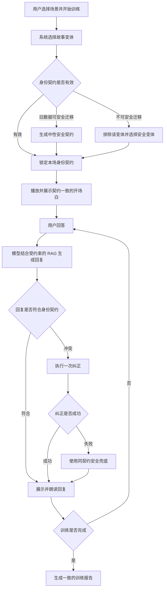
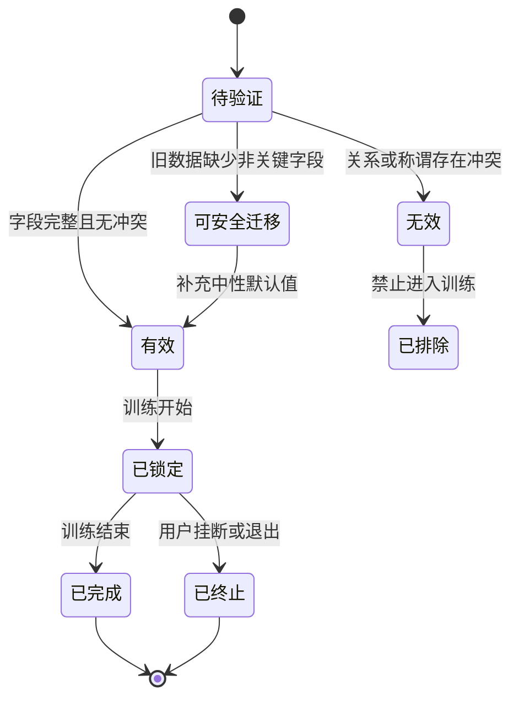
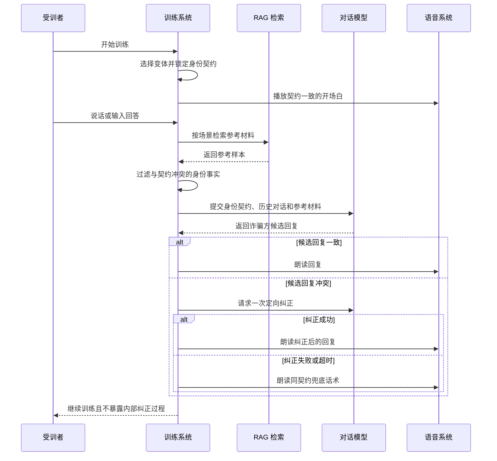

# 产品需求文档：银龄智盾场景身份与称谓一致性治理 - V1

## 0. 文档信息

| 项目 | 内容 |
| --- | --- |
| PRD 编号 | PRD-SCENARIO-IDENTITY-CONSISTENCY-V1 |
| 产品 | 银龄智盾沉浸式反诈心理免疫训练系统 |
| 版本 | V1.0 |
| 状态 | 已实施，已通过本地验收 |
| 目标范围 | 全部 14 个训练场景的身份一致性框架；首批强制迁移 SC-13、SC-14 |
| 不涉及 | 新增用户资料页、改变训练 UI、真实身份采集、替换模型或语音供应商 |

## 1. 综述 (Overview)

### 1.1 项目背景与核心问题

训练系统目前同时使用故事变体、基础场景库、RAG 检索、DeepSeek/Ollama 生成、脚本兜底、实时语音和训练报告。各链路都可能提供人物信息，但系统没有一份在训练开始时锁定并供全链路共同使用的身份定义，因而出现以下用户已发现的问题：

1. **SC-14 绑架勒索身份冲突**：同一训练中可能交替出现“外甥”“儿子”“孩子”等不同被绑架对象；求救音频固定说“妈，救我”，既暗示被绑者是女儿，也默认受训者是母亲。
2. **SC-13 银行账户异常称谓越界**：在没有询问、也不知道受训者性别时，诈骗方使用“叔叔”等带性别称谓。
3. **系统性风险**：即使只手工改掉当前两句话，RAG 样本、模型自由生成、旧基础脚本、在线故事变体或语音提示仍可能再次引入矛盾。

本需求不以“修两句文案”为终点，而是在每次训练开始时生成并锁定一份**会话身份契约**。开场白、后续模型回复、RAG、兜底话术、语音音色、求救音频和报告必须共同遵守该契约；不符合契约的内容不得展示或朗读。

### 1.2 产品目标

1. 同一场训练中的诈骗方、受害亲属、姓名、关系、性别、年龄层和称谓始终一致。
2. 未知受训者性别时统一使用“您好”“您”等中性称谓，不依据声音、姓名或设备推断性别。
3. SC-14 的文字身份、求救语音内容和音色完全匹配所选故事变体。
4. DeepSeek、Ollama、RAG、场景库兜底任一链路异常时，训练仍可继续且不产生身份矛盾。
5. 不改变老人现有操作流程，不新增必填问题，不破坏文字训练、实时语音、报告和 14 个场景。

### 1.3 非目标

1. V1 不要求用户提前填写性别、家庭关系或亲属姓名。
2. V1 不根据 ASR 识别结果、声音特征或模型猜测推断用户性别。
3. V1 不重做训练台 UI，不新增身份配置页面。
4. V1 不追求每个场景拥有专属真人录音，仅要求语义、角色和可用音色不冲突。
5. V1 不清洗全部原始 TeleAntiFraud 数据；检索结果在进入生成链路前受身份契约约束。

### 1.4 方案比较与决策

| 方案 | 做法 | 优点 | 风险 | 结论 |
| --- | --- | --- | --- | --- |
| A. 逐句手工改文案 | 直接把当前“叔叔”“儿子”“外甥”“妈”改掉 | 改动最快 | 模型、RAG、旧脚本和音频仍会重新引入矛盾 | 不采用 |
| B. 会话身份契约 | 每个故事变体声明身份事实，训练开始后锁定；所有输出统一校验 | 能覆盖文字、模型、RAG、兜底、语音和报告 | 需要扩展数据结构与质检 | **采用** |
| C. 每次训练先询问用户资料 | 开始前询问性别和家庭成员 | 可高度个性化 | 增加老人操作负担和隐私风险，也不适合快速演示 | 暂不采用 |

### 1.5 核心业务流程 / 用户旅程地图

1. **阶段一：场景准备** - 系统选择故事变体并验证其身份事实是否完整、安全。
2. **阶段二：会话锁定** - 系统生成身份契约快照，同一训练内不得随数据来源改变。
3. **阶段三：一致对话** - 开场白、模型、RAG 和兜底均在身份契约边界内生成或选取内容。
4. **阶段四：一致语音** - TTS、求救语音和环境音根据当前变体身份决定是否播放及使用何种声音。
5. **阶段五：报告留痕** - 报告记录本场变体和身份摘要，但不新增用户敏感资料。
6. **阶段六：质量守门** - 发布前自动检查 14 个场景，阻止身份不完整或互相矛盾的变体上线。

### 1.6 Mermaid 图

#### 1.6.1 用户操作流



#### 1.6.2 身份契约状态机



#### 1.6.3 关键对话时序



## 2. 核心数据定义

### 2.1 会话身份契约

每个故事变体必须能够形成以下逻辑信息。字段名称可在实现阶段按现有代码规范调整，但语义不得丢失。

```text
会话身份契约
├─ 受训者
│  ├─ 性别：未知 / 女 / 男
│  └─ 默认称谓：您
├─ 来电人
│  ├─ 角色
│  ├─ 显示姓名（可选）
│  └─ 性别或音色类型
├─ 事件对象
│  ├─ 类型：账户 / 亲属 / 事件
│  ├─ 与受训者关系（可选）
│  ├─ 姓名（可选）
│  ├─ 性别（可选）
│  ├─ 年龄层（可选）
│  └─ 允许使用的同义称呼
├─ 禁止词与禁止身份
└─ 求救语音规则（可选）
   ├─ 是否允许播放人声
   ├─ 文本
   ├─ 音色画像
   └─ 无匹配音色时的降级方式
```

### 2.2 全局称谓规则

1. 受训者性别默认为“未知”，默认称谓为“您好”或“您”。
2. 性别未知时，禁止使用“叔叔、阿姨、先生、女士、大哥、大姐、爷爷、奶奶、妈、爸”等推断性称谓。
3. 系统不得依据受训者声音、姓名、浏览器账号、设备或对话内容推断性别。
4. 只有故事变体明确规定且该规定描述的是**虚构角色关系**时，才可使用性别化亲属身份，例如“您的女儿小雪”。
5. 亲属求救人不得用“妈”“爸”称呼未知性别的受训者；默认使用不带家长性别的求救语句。

### 2.3 身份事实优先级

从高到低依次为：

1. 本场已锁定的身份契约。
2. 当前故事变体的开场白和安全兜底话术。
3. 当前场景的角色设定。
4. RAG 检索参考样本。
5. 基础场景库的旧话术。

低优先级内容与高优先级身份事实冲突时，只能作为诈骗手法或语言风格参考，不能覆盖身份契约。

## 3. 首批场景迁移基线

### 3.1 SC-13 银行账户异常诈骗

#### 统一规则

1. 三个故事变体的受训者性别均为“未知”。
2. 所有开场白、fallback、AI 回复、报告复盘均使用“您好”“您”。
3. 禁止出现“叔叔、阿姨、先生、女士”等性别称谓。

#### SC-13-V03 必改基线

现状：

```text
叔叔您好，您是我们的优质客户，信用卡可以提升一笔额度，今天确认后就能生效。
```

目标：

```text
您好，您是我们的优质客户，信用卡可以提升一笔额度，今天确认后就能生效。
```

### 3.2 SC-14 绑架勒索诈骗

#### SC-14-V01：女儿小雪被绑架索款

本变体作为用户所述问题的首要修复对象，身份固定为：

| 身份项 | 固定值 |
| --- | --- |
| 受训者 | 性别未知，称谓“您” |
| 被绑架对象 | 女儿 |
| 姓名 | 小雪 |
| 性别与年龄层 | 年轻女性 |
| 允许称呼 | 小雪、您的女儿、她 |
| 禁止称呼 | 儿子、外甥、孙子、孩子他爸、妈、爸 |
| 求救音色 | 年轻女声 |

开场白基线：

```text
你先别挂电话。你的女儿小雪现在在我们这里。想让她平安，就按我说的做，不准报警。
```

求救语音基线：

```text
救救我……我好害怕……
```

求救语音不得再说“妈，救我”，从而避免默认受训者是母亲。

#### SC-14-V02：孙辈交通事故勒索

1. 被勒索事件对象固定为“孙子”，后续仅允许“孙子、他”等一致称呼。
2. 只有存在匹配的年轻男性音色或录音时，才播放亲属人声。
3. 没有匹配音色时，仅播放电话杂音、碰撞声等非语言环境音，不得套用年轻女声求救。

#### SC-14-V03：冒充境外警方扣留

1. 事件对象保持中性的“亲属”或变体明确写明的单一关系。
2. 未明确亲属性别时，不使用“他/她”，改用“您的亲属”。
3. 未提供与身份契约匹配的求救角色时，仅播放环境音，不播放固定亲属人声。

## 4. 用户故事详述 (User Stories)

### 阶段一：场景准备与会话锁定

---

#### US-01：作为受训者，我希望同一场训练的人物关系被固定，以便理解连贯的诈骗情境

* **价值陈述**：系统在训练开始时锁定故事变体及身份契约，后续数据源不得改变人物关系。
* **业务规则与逻辑**：
  1. 开始训练前验证变体能否形成有效身份契约。
  2. 身份契约作为会话快照保存到本场训练状态中。
  3. 切换场景、重新开始或明确开始新训练时才允许更换契约。
  4. 同一会话中即使模型、RAG 或 fallback 来源发生变化，契约仍保持不变。
* **异常处理**：
  1. 旧变体缺少受训者称谓时，自动补为“性别未知、称谓您”。
  2. 旧变体的亲属关系互相冲突且无法安全推断时，不进入可选池，改选有效变体。
* **验收标准**：
  * **GIVEN** SC-14-V01 被选中，**WHEN** 完成至少 8 轮训练且中途发生 AI 与 fallback 切换，**THEN** 所有内容只使用“小雪、您的女儿、她”。
  * **GIVEN** 在线存储中存在无有效身份契约的旧变体，**WHEN** 用户开始训练，**THEN** 页面不崩溃且不会加载该不安全变体。

---

#### US-02：作为未知性别的受训者，我希望系统使用中性称谓，以免被错误称呼

* **价值陈述**：不要求老人填写资料，也不冒险猜测其性别。
* **业务规则与逻辑**：
  1. 默认始终按未知性别处理。
  2. 开场白、模型回复、兜底、语音和报告均执行中性称谓规则。
  3. 本规则适用于全部 14 个场景，SC-13 为首批强制验收场景。
* **异常处理**：候选文本出现禁止称谓时，不得直接展示或朗读，进入纠正或安全兜底。
* **验收标准**：
  * **GIVEN** 用户进入 SC-13-V03 且未提供性别，**WHEN** 完成一场训练，**THEN** 全程使用“您好/您”，不出现“叔叔/阿姨/先生/女士”。
  * **GIVEN** 模型候选回复含“叔叔”，**WHEN** 系统处理该回复，**THEN** 用户看不到也听不到该错误称谓。

### 阶段二：对话、RAG 与兜底一致性

---

#### US-03：作为受训者，我希望 AI 和 RAG 不改变本场身份，以便对话自然可信

* **价值陈述**：保留 RAG 的真实语料价值，同时防止参考样本把其他案例的人物关系带入当前场景。
* **业务规则与逻辑**：
  1. 模型上下文必须包含简洁、明确、不可覆盖的身份契约。
  2. RAG 命中的“外甥、儿子、孙子”等身份若与当前契约冲突，必须在进入模型前过滤、泛化或仅保留手法信息。
  3. 模型候选回复返回后执行确定性一致性校验。
  4. 冲突时允许一次定向纠正；纠正仍失败、超时或接口异常时，立即使用同契约安全 fallback。
  5. 内部纠正过程不向老人展示，不增加操作步骤。
* **异常处理**：DeepSeek、Ollama 或 DashScope 任一失败时，沿用现有回退链路，但所有回退结果仍必须通过身份校验。
* **验收标准**：
  * **GIVEN** SC-14-V01 的 RAG 样本包含“外甥”，**WHEN** 生成下一轮回复，**THEN** 最终内容仍只描述女儿小雪。
  * **GIVEN** 模型首次返回“你儿子在我们手上”，**WHEN** 纠正请求失败，**THEN** 系统使用女儿小雪版本的 fallback，页面和 TTS 不出现错误文本。

---

#### US-04：作为受训者，我希望场景库兜底也保持同一身份，以便 AI 失败时训练仍然连贯

* **价值陈述**：无网络或 API 失败时仍可稳定训练，不以身份矛盾换取“继续可用”。
* **业务规则与逻辑**：
  1. 变体 fallback 用尽后，不得继续拼接未经身份治理的基础场景旧脚本。
  2. 可循环使用不重复过密的契约安全 fallback，或使用按契约填充的中性模板。
  3. fallback 必须保留现有风险点、教练建议和训练轮次更新能力。
* **异常处理**：若没有任何可用的契约安全文本，则结束当前诈骗方推进并给出可恢复提示，不输出矛盾内容。
* **验收标准**：
  * **GIVEN** 关闭所有 AI 且训练轮次超过变体自带 fallback 数量，**WHEN** 用户继续回答，**THEN** 后续每轮身份仍一致，不从旧基础脚本混入其他人物。
  * **GIVEN** fallback 构建异常，**WHEN** 系统无法得到安全回复，**THEN** 训练页面不白屏，用户仍可挂断、切换场景或查看已有记录。

### 阶段三：语音与报告一致性

---

#### US-05：作为语音训练用户，我希望求救语音与文字角色一致，以便获得可信且不冒犯的体验

* **价值陈述**：声音是沉浸式训练的重要组成，错误性别或称谓会比文字矛盾更明显。
* **业务规则与逻辑**：
  1. 亲属求救语音从当前变体身份契约读取，不再使用 SC-14 全场景共享的固定人声文本。
  2. 文本、声音年龄层和性别三者必须匹配。
  3. 无匹配音色或身份信息不足时，降级为非语言环境音，而不是播放错误人声。
  4. 浏览器语音和阿里云实时语音使用相同的可播放文本与角色判断。
* **异常处理**：音频资源加载失败时跳过该提示，不影响诈骗方主话术、ASR、挂断和报告。
* **验收标准**：
  * **GIVEN** SC-14-V01，**WHEN** 触发亲属求救，**THEN** 播放年轻女声“救救我……我好害怕……”，且不出现“妈/爸”。
  * **GIVEN** SC-14-V02 没有合适的年轻男性音色，**WHEN** 触发求救线索，**THEN** 只播放环境音，训练继续可用。
  * **GIVEN** 用户挂断，**WHEN** 正在播放求救语音，**THEN** 音频立即停止且不会串入下一场训练。

---

#### US-06：作为答辩者或训练管理者，我希望报告与本场身份一致，以便复盘可信

* **价值陈述**：报告不得重新概括成另一位亲属或另一种称谓。
* **业务规则与逻辑**：
  1. 报告请求携带本场变体 ID 和非敏感身份摘要。
  2. 规则报告与 AI 总结均遵守同一身份契约。
  3. 报告中不新增真实用户性别、真实亲属姓名或声音推断结果。
* **异常处理**：AI 报告总结冲突时，删除冲突总结并保留规则结构化报告。
* **验收标准**：
  * **GIVEN** SC-14-V01 训练完成，**WHEN** 打开报告，**THEN** 报告只提及“女儿小雪/您的女儿”，不出现其他亲属。
  * **GIVEN** AI 报告不可用，**WHEN** 打开报告，**THEN** 规则报告正常展示且身份一致。

### 阶段四：维护与发布质量

---

#### US-07：作为维护者，我希望发布前自动发现身份冲突，以便问题不再依赖人工试玩发现

* **价值陈述**：将已发现的问题固化为自动门禁，降低 42 个故事变体持续维护的成本。
* **业务规则与逻辑**：
  1. 质检脚本检查身份契约字段完整性、允许称呼、禁止词、性别称谓和求救音色匹配。
  2. 检查开场白、fallback、基础场景候选话术和语音提示文本。
  3. SC-13、SC-14 的身份错误视为阻断发布的 error，而不是 warning。
  4. 在线管理页保存或启用变体前执行同等校验，Netlify Blobs 中的旧覆盖数据也必须接受检查。
  5. Python/Gradio 与 Next.js 读取相同身份事实，避免双端口径不同。
* **异常处理**：旧在线变体不满足新规则时保持数据可回滚，但不得被选入新训练。
* **验收标准**：
  * **GIVEN** 变体开场白含“叔叔”且受训者性别未知，**WHEN** 执行质量检查，**THEN** 检查失败并指出变体 ID、字段和冲突词。
  * **GIVEN** SC-14 文字为“孙子”但求救音色为年轻女声，**WHEN** 执行质量检查，**THEN** 检查失败并禁止发布。
  * **GIVEN** 所有 14 个场景数据合法，**WHEN** 执行训练烟雾测试，**THEN** 每个场景可开始、可完成至少一轮、可 fallback、可生成报告。

## 5. 功能规则总表

| 编号 | 规则 | 级别 |
| --- | --- | --- |
| ID-01 | 一场训练只能存在一份锁定的身份契约 | 必须 |
| ID-02 | 未知用户性别时只能使用中性称谓 | 必须 |
| ID-03 | 契约优先级高于 RAG、模型和基础场景库 | 必须 |
| ID-04 | 冲突候选文本不得展示或进入 TTS | 必须 |
| ID-05 | 冲突回复最多纠正一次，失败后进入安全 fallback | 必须 |
| ID-06 | fallback 不得拼接未经治理的旧基础脚本 | 必须 |
| ID-07 | 求救人声必须与关系、性别和年龄层匹配 | 必须 |
| ID-08 | 无匹配人声时允许降级为环境音 | 必须 |
| ID-09 | 报告沿用本场身份契约 | 必须 |
| ID-10 | 不通过声音或文本猜测真实用户性别 | 必须 |
| ID-11 | 旧数据可安全中性化时自动兼容，否则排除 | 必须 |
| ID-12 | 现有文字、语音、RAG、AI、fallback 和报告链路不得因本需求失效 | 必须 |

## 6. 异常与降级策略

| 异常 | 系统行为 | 用户可见结果 |
| --- | --- | --- |
| 故事变体缺少受训者称谓 | 自动补为“性别未知、您” | 无额外操作 |
| 亲属关系存在多个互斥值 | 排除该变体并选择有效变体 | 正常进入训练 |
| RAG 样本身份冲突 | 过滤身份词，只保留诈骗手法参考 | 对话正常 |
| 模型回复身份冲突 | 一次定向纠正 | 不展示错误草稿 |
| 模型纠正失败或超时 | 同契约 fallback | 训练继续 |
| fallback 用尽 | 使用契约安全模板或有限轮换 | 不混入旧人物 |
| 求救音色不匹配 | 仅播放环境音 | 语音训练继续 |
| TTS/音频失败 | 跳过音频，保留文字和训练控制 | 可继续或挂断 |
| AI 报告身份冲突 | 移除 AI 段落，保留规则报告 | 报告仍可查看 |
| 在线旧变体不合法 | 保留存储但不启用 | 自动使用安全变体 |

## 7. 非功能需求

### 7.1 稳定性

1. 一致性校验本身失败时采用“拒绝不确定内容”的安全策略，不得让页面崩溃。
2. 任一 AI、RAG、语音或在线存储服务不可用时，仍保留场景选择、文字训练、安全挂断和报告基础能力。
3. 新增规则不得改变现有实时语音网关连接方式和 API Key 管理方式。

### 7.2 性能

1. 本地确定性身份校验目标耗时小于 10ms，不应造成用户可感知延迟。
2. 仅在发现冲突时发起一次模型纠正，不为正常回复增加额外模型调用。
3. 音频匹配判断在播放前完成，不增加新的外部请求。

### 7.3 隐私与安全

1. 不采集真实用户性别、亲属姓名或家庭关系。
2. 不使用声纹或声音分类推断用户身份。
3. 诊断日志仅记录场景码、变体 ID、冲突规则编号、内容来源和降级结果；避免新增完整用户语音转写日志。
4. 不在前端暴露 DeepSeek、DashScope 或语音网关密钥。

### 7.4 可观测性

出现身份纠正或降级时，后台应可定位：

```text
场景码 + 变体 ID + 回复来源 + 冲突规则 + 纠正结果 + 最终来源
```

面向普通用户不显示内部规则详情；现有 RAG 调试/运行状态面板可在开发或答辩模式下显示“身份一致性校验：通过/已安全纠正”。

## 8. 数据兼容与迁移

1. 内置 `story-variants.json` 首批迁移 SC-13、SC-14，随后补齐全部 14 个场景的中性受训者规则。
2. 旧变体没有身份契约时，读取层自动补充中性受训者默认值。
3. 涉及亲属但无法确定唯一关系的旧变体，不自动猜测关系；该变体在完成维护前不可启用亲属人声。
4. 在线 Netlify Blobs 覆盖数据与内置种子执行同一校验，不能因为来自在线存储而绕过规则。
5. 管理端修改后的新版本必须显式保存身份契约；旧版本保留用于回滚和审计。
6. Python/Gradio 入口读取同一份变体身份数据，至少保持称谓、关系和 fallback 一致。

## 9. 预期影响模块

以下为实施时需要评估的现有模块，不代表要求重写全部文件：

| 模块 | 需求影响 |
| --- | --- |
| `frontend/data/story-variants.json` | 增加身份契约并迁移 SC-13、SC-14 |
| `frontend/lib/story-variants.ts` | 定义、校验和规范化身份契约 |
| `frontend/lib/story-variant-selector.mjs` | 锁定契约；移除旧基础脚本身份泄漏 |
| `frontend/app/api/training-chat/route.ts` | 提示词约束、RAG 过滤、输出校验与纠正 |
| `frontend/lib/voice/scenario-audio.ts` | 将 SC-14 求救提示改为变体感知 |
| `frontend/app/api/training-report/route.ts` | 报告身份约束与冲突降级 |
| `frontend/scripts/check-scenario-quality.mjs` | 增加称谓、关系和音色一致性门禁 |
| `frontend/scripts/test-story-variants.mjs` | 增加会话锁定和 fallback 穿透测试 |
| `frontend/scripts/run-training-smoke-tests.mjs` | 增加 14 场景回归与故障注入 |
| `app/core/story_variants.py` | Python/Gradio 数据结构与选择逻辑对齐 |
| 动态场景库文件 | 清理会进入候选池的冲突旧话术 |

## 10. 测试与验收矩阵

| 编号 | 测试 | 预期 |
| --- | --- | --- |
| T-01 | SC-13-V03 正常 AI 对话 8 轮 | 仅使用“您好/您” |
| T-02 | SC-13-V03 强制模型返回“叔叔” | 错误文本不展示、不朗读 |
| T-03 | SC-14-V01 正常 AI 对话 8 轮 | 仅“女儿小雪/她” |
| T-04 | SC-14-V01 RAG 命中“外甥/儿子”样本 | 最终回复不采用冲突身份 |
| T-05 | SC-14-V01 模型返回“儿子”且纠正超时 | 使用女儿小雪安全 fallback |
| T-06 | SC-14-V01 触发求救人声 | 年轻女声且不说“妈/爸” |
| T-07 | SC-14-V02 无匹配男声音色 | 仅环境音，不播放女声 |
| T-08 | SC-14-V03 亲属性别未知 | 不用“他/她”，不播放固定求救人声 |
| T-09 | 关闭 DeepSeek、Ollama 与 RAG | fallback 连续训练且身份一致 |
| T-10 | fallback 轮次超过自带话术数量 | 不拼接旧脚本人物 |
| T-11 | Netlify Blobs 中存在无契约旧变体 | 自动中性化或排除，页面不崩 |
| T-12 | 实时语音播放中挂断 | 立即停止且不串音到下一场 |
| T-13 | 训练报告 AI 生成冲突 | 保留规则报告，删除冲突总结 |
| T-14 | 全部 14 场景烟雾测试 | 均可选、可开始、可回复、可结束、可报告 |
| T-15 | Next.js 生产构建 | 构建通过 |
| T-16 | Python/Gradio 启动与单轮训练 | 身份规则与 Next.js 一致 |

## 11. 发布策略

1. **第一阶段：规则与数据迁移** - 上线身份契约结构、SC-13/SC-14 数据和自动质检，但保留功能开关。
2. **第二阶段：对话链路接入** - 接入 RAG 过滤、输出校验、纠正和安全 fallback，完成故障注入测试。
3. **第三阶段：语音与报告接入** - 求救音频变体化，报告使用同一身份契约。
4. **第四阶段：全场景回归** - 对 14 个场景执行自动烟雾测试和人工语音抽测。
5. **第五阶段：线上灰度** - 本地与 Netlify 各完成 SC-13、SC-14 的 AI、RAG、fallback、浏览器语音和实时语音测试后正式启用。

### 11.1 回滚要求

1. 身份契约功能必须具备服务端功能开关，但回滚后仍保留 SC-13 中性称谓和 SC-14 已修正文案，不回滚到已知错误内容。
2. 若模型纠正链路引发延迟，可关闭“二次纠正调用”，直接采用本地安全 fallback。
3. 若变体感知求救音频异常，可关闭亲属人声，仅保留诈骗方 TTS 和环境音。

## 12. 完成定义 (Definition of Done)

只有同时满足以下条件，本需求才算完成：

1. SC-13 不再在未知性别时称呼用户为“叔叔”等性别称谓。
2. SC-14-V01 的开场白、8 轮对话、RAG、AI、fallback、求救音频和报告全部统一为“女儿小雪”。
3. SC-14-V02、V03 在无匹配人声时安全降级，不套用女儿小雪的女声。
4. 模型或 RAG 故意返回冲突身份时，错误内容不会出现在 UI 或 TTS。
5. fallback 用尽后不再从旧基础场景混入其他人物。
6. 14 个场景自动质量检查和训练烟雾测试通过。
7. 文字训练、手机端、电脑端、实时语音、浏览器语音、报告和场景切换均无功能回归。
8. Next.js 生产构建通过，Python/Gradio 至少完成启动和单轮一致性验证。

## 13. 本次实施验收记录

2026-07-16 已完成以下本地验收：

1. `pnpm.cmd run test:identity`：覆盖 SC-13 中性称谓、SC-14 女儿小雪、RAG 身份净化、冲突回退和无匹配亲属人声降级。
2. `pnpm.cmd run test:variants`：42 个故事变体结构、安全规则和防重复选择通过。
3. `pnpm.cmd run test:smoke`：14 个场景、RAG、模型/报告 fallback、身份契约、语音降级、健康检查和网关部署配置通过。
4. TypeScript 无输出检查、ESLint 和 `pnpm.cmd run build` 通过。
5. Python 身份契约同构断言通过；`run_oldcheat.py` 启动后 `http://127.0.0.1:7860/` 返回 200。
6. Next.js 本地训练台 `http://127.0.0.1:3000/` 与 `/api/health` 返回 200。

线上发布时仅需提交并推送本次仓库变更，由 Netlify 自动构建前端；`frontend/voice-gateway/` 本次未修改，因此不需要重新上传语音网关部署包。
