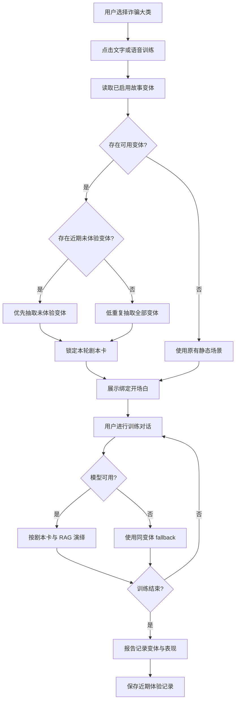
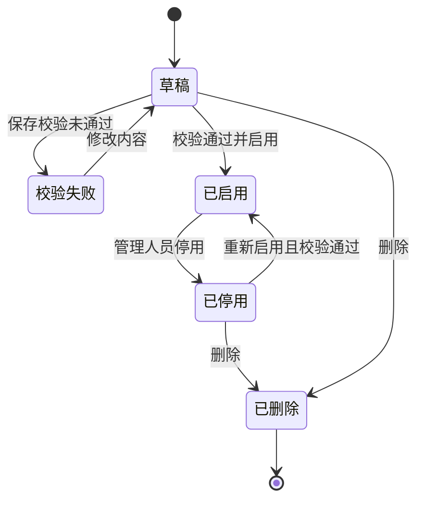

# 产品需求文档：OldCheat 可持续故事变体训练 - V1

## 1. 综述 (Overview)

### 1.1 项目背景与核心问题

OldCheat 当前按诈骗大类提供训练。用户完成每个场景一次后，容易记住固定开场和剧情推进，重复训练的新鲜感、迁移训练价值和持续使用动力不足。本需求在不替换现有 14 个诈骗大类、模型、RAG、语音与报告能力的前提下，为每个大类增加多个可维护的“故事变体”。系统在每次训练开始时抽取完整变体，并在本轮锁定人物、背景、诈骗目标、压力手法、开场白和兜底话术；模型只负责在该边界内演绎。

目标：同一诈骗大类连续训练时不立即重复同一故事；模型异常时仍保持剧情一致；内部人员可用轻量页面维护变体；任何新增链路失效时均能回到原有静态场景。

非目标：无限自由生成犯罪剧本、真实转账/账号/链接、复杂 CMS、多角色审批、完整用户账户体系、替换现有场景库或评分算法。

### 1.2 核心业务流程 / 用户旅程地图

1. **阶段一：选择场景并开始** - 用户选择诈骗大类，以原有文字或语音入口开始训练。
2. **阶段二：抽取并锁定变体** - 系统优先抽取近期未体验的已启用变体，建立本轮剧本卡。
3. **阶段三：一致演绎与降级** - 模型、RAG 和 fallback 均服从剧本卡，直至训练结束。
4. **阶段四：报告与防重复记录** - 报告展示具体变体，浏览器保存近期体验记录供下次抽取。
5. **阶段五：内部内容维护** - 管理人员维护、校验、启停故事变体。
6. **阶段六：兼容与恢复** - 在线存储、模型或变体数据异常时保留原训练能力。

### 1.3 Mermaid 图（流程/状态/时序）

#### 1.3.1 用户操作流



#### 1.3.2 故事变体状态机



#### 1.3.3 关键训练时序

```mermaid
sequenceDiagram
  participant U as 训练用户
  participant A as 训练台
  participant V as 变体存储
  participant M as 对话模型
  U->>A: 点击开始训练
  A->>V: 获取已启用变体
  alt 在线数据可用
    V-->>A: 返回可用变体
  else 在线数据异常
    A-->>A: 使用内置种子变体
  end
  A-->>U: 展示锁定变体的开场白
  U->>A: 回复
  A->>M: 携带剧本卡与对话历史生成下一轮
  alt 模型成功
    M-->>A: 返回一致剧情话术
  else 模型失败或超时
    A-->>A: 选用本变体 fallback
  end
  A-->>U: 展示或播放下一轮话术
```



## 2. 用户故事详述 (User Stories)

### 阶段一：选择场景并开始

---

#### **US-01：作为训练用户，我希望重新进入同一诈骗大类时遇到不同故事，以便重复练习而不是背答案。**

* **价值陈述**：作为训练用户，我希望保留熟悉的场景选择方式，同时获得不同人物和事件，以便练习识别诈骗规律。
* **业务规则与逻辑**：
  1. 原有 14 个场景、文字入口和语音入口保持不变。
  2. 只有点击“开始训练”或“开始语音训练”时才抽取变体，选择阶段不提前随机，避免界面闪烁。
  3. 同一次训练的文字、浏览器语音和实时语音共用同一变体。
  4. “重新开始”视为新训练，应重新抽取；存在至少两个启用变体时不得立即重复上一次变体。
  5. 若没有可用变体，沿用原静态脚本并给内部诊断记录降级原因，普通用户不看到技术错误。
* **验收标准**：
  * **GIVEN** 某场景有三个启用变体，**WHEN** 用户连续开始两次训练，**THEN** 第二次不得使用第一次的变体。
  * **GIVEN** 变体服务不可用，**WHEN** 用户开始训练，**THEN** 原有开场白仍出现且训练可继续。
  * **GIVEN** 用户开始语音训练，**WHEN** 第一段语音播放，**THEN** 内容必须等于本轮锁定变体的开场白。

* **页面布局线框图**：

```text
+----------------------+------------------------------------------+
| 诈骗场景列表         | 当前场景                                 |
| [冒充公检法]         | 冒充公检法                               |
| [投资理财]           | 每次训练会随机进入一个不同模拟案件       |
| [网络刷单]           |                                          |
| ...                  | [开始文字训练]  [开始语音训练]           |
+----------------------+------------------------------------------+
```

---

### 阶段二：抽取并锁定变体

#### **US-02：作为训练用户，我希望一次训练中的人物和事实保持一致，以便获得可信的沉浸体验。**

* **业务规则与逻辑**：
  1. 剧本卡至少包含：变体 ID、所属场景、标题、人物身份、来源显示、事件背景、诈骗目标、压力手法、开场白、fallback 话术、版本。
  2. 变体抽取后复制到当前会话；后台编辑不能改变已经开始的训练。
  3. 开场白必须来自所选变体，后续模型提示词必须包含同一剧本卡。
  4. 变体不能改变所属诈骗大类，不能引入真实联系方式、账号、网址、验证码或可执行犯罪步骤。
* **验收标准**：
  * **GIVEN** 变体人物为“医保中心工作人员”，**WHEN** 对话持续多轮，**THEN** 系统提示词、展示身份和 fallback 均不得切换为银行经理等其他身份。
  * **GIVEN** 管理员在训练中修改该变体，**WHEN** 用户继续当前会话，**THEN** 当前会话仍使用开始时的剧本卡快照。

---

### 阶段三：一致演绎与降级

#### **US-03：作为训练用户，我希望模型围绕本轮故事自然回应，以便不同回答产生不同但不串戏的剧情。**

* **业务规则与逻辑**：
  1. 模型输入同时包含大类规则、剧本卡、最近对话和匹配的 RAG 参考。
  2. 剧本卡事实优先于 RAG 示例；RAG 只提供语言风格和风险模式，不得覆盖人物与事件。
  3. 输出仍执行现有敏感信息限制、长度清洗、身份规范化和语音提示处理。
  4. 温度允许自然变化，但不得重新生成或修改剧本卡。
* **验收标准**：
  * **GIVEN** 用户质疑人物身份，**WHEN** 模型生成回复，**THEN** 回复应延续本轮人物和背景而不是泛化为客服。
  * **GIVEN** RAG 返回另一人物样本，**WHEN** 模型生成回复，**THEN** 只能借用话术模式，不得采用另一人物姓名或机构。

#### **US-04：作为训练用户，我希望模型或网络失败时剧情仍能继续，以便服务故障不破坏训练。**

* **业务规则与逻辑**：
  1. DeepSeek 失败后保留现有 Ollama 回退顺序；所有模型失败后使用当前变体 fallback。
  2. fallback 按轮次循环，不能退回其他变体或其他诈骗大类的脚本。
  3. 当前变体无 fallback 时，才回退到所属大类原有 script。
  4. 失败不清空消息、风险分、语音状态或报告事件。
* **验收标准**：
  * **GIVEN** 模型全部不可用且变体有 fallback，**WHEN** 用户回复，**THEN** 下一句来自该变体 fallback，来源标记为 fallback。
  * **GIVEN** 变体 fallback 为空，**WHEN** 模型失败，**THEN** 使用大类静态 script，训练不报错退出。

---

### 阶段四：报告与防重复记录

#### **US-05：作为训练用户或陪练家属，我希望报告说明本次具体故事，以便理解训练覆盖了什么。**

* **业务规则与逻辑**：
  1. 报告场景信息增加变体标题、人物身份、事件背景、诈骗目标和变体 ID。
  2. AI 报告提示词接收变体信息，但评分公式保持不变。
  3. 变体信息缺失时，报告按旧格式生成。
  4. 浏览器仅记录变体 ID、场景 ID、完成时间和表现摘要，不保存真实个人敏感信息。
* **验收标准**：
  * **GIVEN** 本轮使用“快递违禁品转公安”变体，**WHEN** 打开报告，**THEN** 报告明确显示该变体而非只显示“冒充公检法”。
  * **GIVEN** 使用旧静态场景，**WHEN** 打开报告，**THEN** 报告仍可生成且不出现空字段占位。

---

### 阶段五：内部内容维护

#### **US-06：作为内部内容维护人员，我希望维护故事变体，以便持续补充训练内容而无需修改训练组件。**

* **业务规则与逻辑**：
  1. 管理页面需要管理令牌；令牌仅保存在当前浏览器会话，不写入仓库或返回给普通训练接口。
  2. 支持按场景筛选、创建、编辑、启用/停用和删除变体。
  3. 必填项：所属场景、标题、人物、背景、诈骗目标、开场白、至少一条 fallback。
  4. 保存前检查 ID 唯一、文本长度、所属场景存在、危险内容和真实联系方式模式。
  5. 写入成功后普通训练读取立即生效；失败时保留表单内容并显示可理解原因。
* **验收标准**：
  * **GIVEN** 管理令牌正确且表单完整，**WHEN** 保存并启用变体，**THEN** 刷新列表后仍存在且可被训练抽取。
  * **GIVEN** 开场白包含真实网址或长账号，**WHEN** 保存，**THEN** 系统拒绝并指出安全校验失败。
  * **GIVEN** 令牌错误，**WHEN** 尝试写入，**THEN** 系统拒绝且不改变已有数据。

* **页面布局线框图**：

```text
+--------------------------------------------------------------------------------+
| 故事变体维护                         管理令牌 [************] [连接/刷新]         |
+------------------------------+-------------------------------------------------+
| 场景 [全部 v]  [新建变体]    | 变体编辑                                        |
|                              | 所属场景 [SC-01 冒充公检法 v]                   |
| ● 银行卡涉案调查   已启用    | 标题 [银行卡涉案调查________]                   |
| ○ 快递违禁品转接   已停用    | 人物 [某市公安局工作人员____]                  |
| ● 手机号涉案核查   已启用    | 背景 [______________________]                  |
|                              | 目标 [______________________]                  |
|                              | 压力手法 [恐吓、隔离、限时____]                 |
|                              | 开场白 [____________________]                  |
|                              | fallback 每行一条 [__________]                 |
|                              | [启用 ✓] [删除]                   [保存变体]    |
+------------------------------+-------------------------------------------------+
```

---

### 阶段六：兼容与恢复

#### **US-07：作为项目维护者，我希望新功能可以独立关闭和自动降级，以便避免升级造成现有项目崩坏。**

* **业务规则与逻辑**：
  1. 内置种子变体随版本发布；线上覆盖数据使用站点级持久化对象存储，本地开发使用本地覆盖文件。
  2. 读取覆盖数据失败时自动使用种子；种子也异常时使用原 Scenario script。
  3. 新增字段全部可选，旧 API 请求和旧报告数据继续可解析。
  4. `STORY_VARIANTS_ENABLED=false` 时完全跳过变体抽取。
  5. 写入接口必须动态响应且禁止缓存；普通读取可以短时缓存，但管理写入后的读取需要强一致。
* **验收标准**：
  * **GIVEN** 功能开关关闭，**WHEN** 开始训练，**THEN** 行为与升级前一致。
  * **GIVEN** 在线持久化服务异常，**WHEN** 加载训练页，**THEN** 内置变体或旧脚本仍可用。
  * **GIVEN** 旧客户端不发送 variant，**WHEN** 调用训练 API，**THEN** API 按旧逻辑成功响应。

#### **US-08：作为项目维护者，我希望有确定性测试和质量门禁，以便随机逻辑可复现、可排障。**

* **业务规则与逻辑**：
  1. 抽取函数允许注入随机数，自动测试不得依赖真实随机结果。
  2. 质量检查覆盖全部 14 个场景均至少三个有效种子变体、ID 唯一、字段完整、安全规则通过。
  3. 构建、lint、场景质检和 smoke test 均纳入验收。
  4. 日志只记录变体 ID、数据来源和降级原因，不记录管理令牌或用户敏感输入。
* **验收标准**：
  * **GIVEN** 固定随机输入和相同历史，**WHEN** 运行抽取测试，**THEN** 每次得到同一结果。
  * **GIVEN** 任一场景少于三个有效种子变体，**WHEN** 运行质量检查，**THEN** 检查失败并指出场景 ID。

## 3. 数据规则与字段定义

| 字段 | 规则 |
| --- | --- |
| `id` | 全局唯一、稳定、不随标题修改，建议 `SC-01-V01` |
| `scenarioCode` | 必须匹配现有 `SC-01` 至 `SC-14` |
| `title` | 4-40 个字符，报告与管理页可见 |
| `persona` | 2-50 个字符，同一会话不可变化 |
| `source` | 训练界面显示的模拟来源，不得包含真实联系方式 |
| `premise` | 10-240 个字符，描述本轮事件事实 |
| `objective` | 4-120 个字符，描述诈骗者希望诱导的模拟行为 |
| `pressureTactics` | 1-6 项，每项 2-30 个字符 |
| `opening` | 10-180 个字符，必须与 persona 和 premise 一致 |
| `fallbackLines` | 1-12 条，每条 8-180 个字符 |
| `enabled` | 只有启用变体进入训练抽取池 |
| `version` | 正整数，每次内容更新递增 |
| `updatedAt` | ISO 8601 时间，仅用于维护和审计 |

## 4. 非功能需求

* 性能：内置变体不增加首屏网络依赖；在线读取目标 p95 小于 500ms，超时不阻塞训练。
* 可用性：变体链路故障不得导致训练主流程不可用；目标为“降级可用”而非强依赖在线存储。
* 安全：写操作需要服务器环境变量中的管理令牌；令牌不进入公开 bundle、日志和普通读取响应。
* 隐私：防重复历史优先保存在浏览器；V1 不建立用户画像数据库，不上传个人信息。
* 可维护性：种子、覆盖、旧脚本三层来源有明确优先级；变体校验函数被 API、管理页和测试复用。
* 成本：使用单个小型 JSON 文档存储全部变体，避免引入独立数据库和常驻服务。

## 5. 成功指标

* 14 个场景均至少有 3 个启用种子变体。
* 同一浏览器同一场景连续两次训练的变体立即重复率为 0（可用变体数大于 1 时）。
* 变体或在线存储故障下，开始训练成功率与改造前一致。
* 模型失败时，fallback 与本轮变体身份一致率为 100%。
* 管理页非法内容拦截率为 100%，未授权写入成功数为 0。

## 6. 发布与回滚

1. 先发布内置种子与只读抽取，保持功能开关默认可关闭。
2. 通过场景质检、smoke、lint、生产构建后启用训练抽取。
3. 再配置管理令牌并启用在线覆盖写入。
4. 出现异常时先关闭 `STORY_VARIANTS_ENABLED`；无需回滚场景库、模型、RAG 或报告代码即可恢复旧流程。

