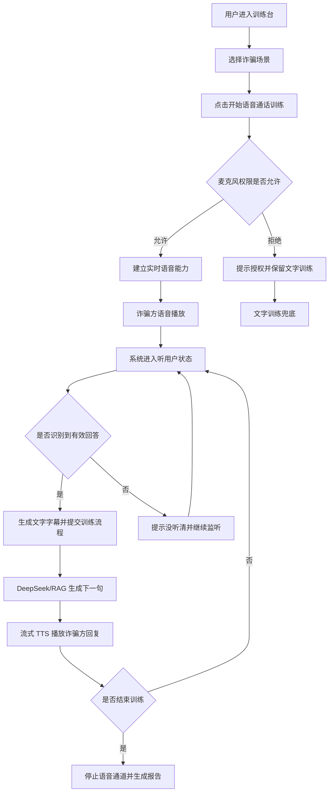
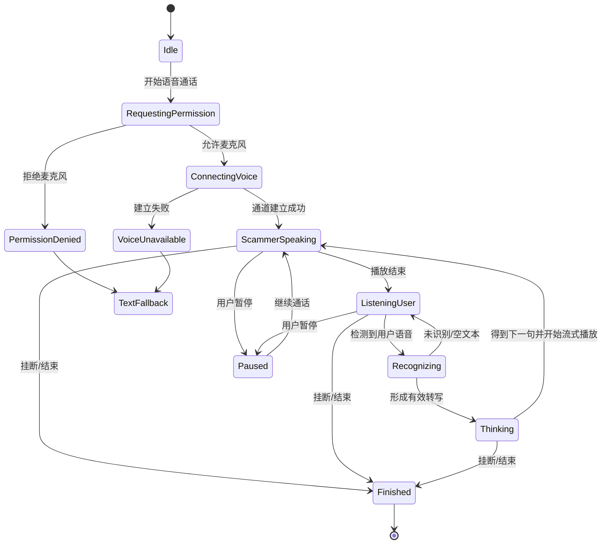
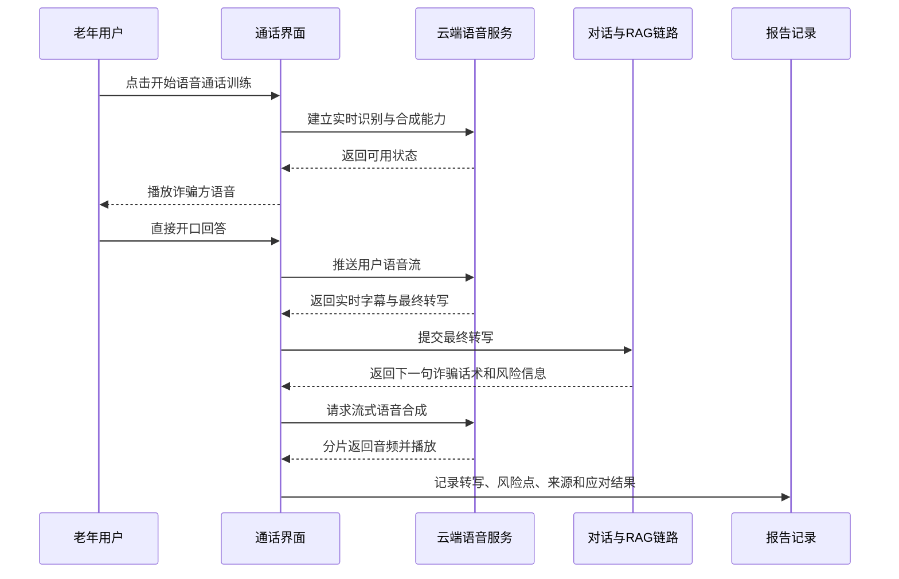

# 产品需求文档：银龄反诈实时语音通话训练模式 - V3

## 1. 综述 (Overview)

### 1.1 项目背景与核心问题

OldCheat 当前已经具备 Next.js 训练台、动态场景库、DeepSeek 对话生成、RAG 检索、风险识别、训练报告，以及第一版“电话外观 + 轮式语音内核”的语音训练能力。第一版已验证可用：老人可以点击语音训练，系统朗读诈骗话术，浏览器识别老人语音后提交到现有训练流程。

V3 的目标是把“像电话”升级为“更接近真实电话”：用户不再明显感知“说一句、等一句”的分段感，而是在一个连续通话界面里完成实时语音交互。系统需要边听边识别、边生成字幕，并用流式语音合成播放诈骗方回复，同时继续保留现有文本字幕、风险识别、RAG、训练报告和文字兜底。

本 PRD 不要求实现真正 PSTN 电话拨打，也不要求接入 WebRTC 通话网络。V3 的“实时通话”定义为：浏览器端连续麦克风采集 + 云端实时 ASR + 大模型对话生成 + 云端流式 TTS + 电话式 UI 状态机。

### 1.2 核心业务流程 / 用户旅程地图

1. **进入语音通话模式** - 用户选择或默认进入一个诈骗场景，点击“开始语音通话训练”。
2. **建立实时语音通道** - 系统申请麦克风权限，获取云端语音临时凭证，建立实时 ASR 与流式 TTS 能力。
3. **连续通话训练** - 诈骗方以语音说话，用户直接开口回应，系统实时生成字幕、识别意图、推进对话。
4. **实时教练与安全干预** - 系统在通话中持续更新风险等级、心理弱点、建议和求助/挂断入口。
5. **结束与报告复盘** - 用户挂断或达到训练目标后，系统停止音频通道，生成包含语音转写、风险节点和改进建议的训练报告。

### 1.3 关键计费与成本假设

根据阿里云官方文档，阿里云当前有两条可用于 V3 的语音路线：一条是智能语音交互（ISI/NLS）实时识别与流式合成，通常使用 AppKey、AccessKey ID/Secret 和 Token；另一条是百炼 Model Studio 的实时语音识别与 Qwen-TTS Realtime WebSocket，通常使用 DashScope/百炼 API Key。由于本项目已经接入阿里云百炼 embedding，且用户希望沿用既有阿里云 `sk-...` key，V3 首选路线定义为 **百炼实时 ASR + Qwen-TTS Realtime**；传统 ISI/NLS 作为备选方案。

官方同时说明价格仅供参考，实际以出账账单为准。实时语音识别按推流时长计费，语音合成按字符或调用量计费，流式文本语音合成按字数计费。

本项目 V3 的单场成本目标为 **0.30-0.60 元/场**。该目标成立需要满足以下产品约束：

- 单场训练控制在 5-8 分钟。
- ASR 仅在用户可说话阶段推流，不在诈骗方 TTS 播放时持续推流。
- 每轮诈骗方回复控制在 40-90 个汉字，避免 TTS 字数膨胀。
- 默认训练轮次控制在 8-12 轮。
- 对话生成仍复用现有 DeepSeek/RAG 链路，避免额外语音大模型常开成本。

参考来源：

- 阿里云智能语音交互计费项：https://help.aliyun.com/zh/isi/product-overview/pricing
- 阿里云智能语音交互计费方式：https://help.aliyun.com/zh/isi/product-overview/billing-10
- 阿里云百炼实时语音识别：https://help.aliyun.com/zh/model-studio/real-time-speech-recognition-user-guide
- 阿里云百炼 Qwen-TTS Realtime：https://help.aliyun.com/zh/model-studio/interactive-process-of-qwen-tts-realtime-synthesis

### 1.4 Mermaid 图

#### 1.4.1 用户操作流



#### 1.4.2 语音通话状态机



#### 1.4.3 关键场景时序



## 2. 用户故事详述 (User Stories)

### 阶段一：进入实时语音通话

---

#### **US-01: 作为老年用户，我希望一键开始语音通话训练，以便不需要阅读复杂说明就能进入训练**

* **价值陈述 (Value Statement)**:
  * **作为** 老年用户
  * **我希望** 点击一个大按钮就能开始语音通话训练
  * **以便于** 不需要理解复杂设置，也能完成反诈训练

* **业务规则与逻辑 (Business Logic)**:
  1. **前置条件**:
     - 用户已进入训练台。
     - 至少存在一个可用诈骗场景。
     - 浏览器支持麦克风权限请求。
  2. **操作流程 (Happy Path)**:
     - 用户点击“开始语音通话训练”。
     - 系统展示电话式通话界面。
     - 系统请求麦克风权限。
     - 用户允许后，系统进入“正在连接语音服务”。
     - 连接成功后，诈骗方第一句话以语音方式播放。
  3. **异常处理 (Error Handling)**:
     - 用户拒绝麦克风：显示“请允许麦克风，或使用文字训练”，保留文字训练入口。
     - 浏览器不支持录音：显示“当前浏览器不支持语音通话，请使用 Edge/Chrome 或文字训练”。
     - 云端语音服务连接失败：提示“语音服务暂时不可用”，自动降级到 V1 浏览器语音或文字训练。
     - 当前场景无脚本：提示切换场景，不进入通话。

* **验收标准 (Acceptance Criteria)**:
  * **场景1: 正常开始通话**
    * **GIVEN** 用户在训练台且浏览器支持麦克风
    * **WHEN** 用户点击“开始语音通话训练”并允许权限
    * **THEN** 系统进入通话界面，显示“对方正在说话”，并播放诈骗方第一句话
  * **场景2: 拒绝麦克风权限**
    * **GIVEN** 用户点击开始语音通话训练
    * **WHEN** 用户拒绝麦克风权限
    * **THEN** 系统提示授权失败，并保留文字训练入口，页面不崩溃

* **页面布局线框图 (ASCII Wireframe)**:

```text
+--------------------------------------------------------------+
| 银龄反诈训练舱                         当前模型 / 帮助 / 重置 |
+--------------------------------------------------------------+
| 场景列表      |              实时语音通话区                   |
| SC-01         |  +----------------------------------------+   |
| SC-02         |  |            来电头像/诈骗身份             |   |
| SC-03         |  |              00:00 通话中                |   |
| ...           |  |          [开始语音通话训练]              |   |
|               |  +----------------------------------------+   |
|               |  字幕区：对方和用户的话会自动显示           |
|               |  大按钮：再说一遍 / 求助子女 / 挂断         |
|               |                                             |
|               |  文字输入兜底区                             |
|               |                                             |
|               |                           实时教练面板       |
+--------------------------------------------------------------+
```

---

### 阶段二：实时听说与字幕

---

#### **US-02: 作为老年用户，我希望系统能边听边识别我的话，以便像真实电话一样自然交流**

* **价值陈述 (Value Statement)**:
  * **作为** 老年用户
  * **我希望** 说话时系统能实时识别并显示字幕
  * **以便于** 我确认系统听到了我的回答，也方便报告记录

* **业务规则与逻辑 (Business Logic)**:
  1. **前置条件**:
     - 语音通话已连接。
     - 当前不处于诈骗方 TTS 播放状态。
  2. **操作流程 (Happy Path)**:
     - 诈骗方语音播放结束后，系统进入“正在听你说”状态。
     - 用户开始说话，系统实时展示中间字幕。
     - 系统检测到停顿或语音结束后，生成最终转写。
     - 最终转写自动进入现有 `handleSend` 训练流程。
     - 该转写被记录到报告事件中。
  3. **异常处理 (Error Handling)**:
     - 识别为空：显示“没听清，请再说一遍”，不推进轮次。
     - 识别置信度低：显示字幕并提示“识别可能不准，可重说或手动修改”。
     - 用户持续不说话：超过 12 秒后播放轻提示“可以直接说，我在听”。
     - 用户说话过长：超过 45 秒自动截断并提交已识别内容，同时提示“这段已记录”。
     - TTS 播放期间检测到环境声：不提交，避免把系统自己的声音识别为用户回答。

* **验收标准 (Acceptance Criteria)**:
  * **场景1: 实时字幕**
    * **GIVEN** 系统处于“请你回答”
    * **WHEN** 用户开始说话
    * **THEN** 页面显示实时字幕，并在停顿后生成最终文本
  * **场景2: 空识别**
    * **GIVEN** 系统处于监听状态
    * **WHEN** 用户没有说话或噪音无法识别
    * **THEN** 系统提示“没听清，请再说一遍”，且不调用对话生成

* **页面布局线框图 (ASCII Wireframe)**:

```text
+--------------------------------------------------+
|                通话中  02:18                      |
|             冒充客服 · 小雨                        |
|                                                  |
|              状态：请你回答                       |
|                                                  |
|  对方字幕：您只要把验证码告诉我就能退款...          |
|                                                  |
|  你的字幕：我不会告诉你验证码，我要先问家人         |
|            ↑ 实时变化，最终文本高亮                |
|                                                  |
|  [再说一遍]       [向子女求助]       [挂断]        |
+--------------------------------------------------+
```

---

#### **US-03: 作为老年用户，我希望诈骗方回复能流式播放，以便减少等待感**

* **价值陈述 (Value Statement)**:
  * **作为** 老年用户
  * **我希望** 对方能像电话里一样连续说话
  * **以便于** 训练体验更接近真实诈骗电话

* **业务规则与逻辑 (Business Logic)**:
  1. **前置条件**:
     - 用户回答已形成最终转写。
     - 现有对话生成链路返回下一句诈骗方回复。
  2. **操作流程 (Happy Path)**:
     - 系统显示“对方正在思考”。
     - DeepSeek/RAG 返回下一句诈骗话术。
     - 系统立即调用流式 TTS。
     - 前端边收到音频边播放，同时显示同步字幕。
     - 播放完成后自动进入监听用户状态。
  3. **异常处理 (Error Handling)**:
     - DeepSeek 超时：使用现有场景库兜底话术。
     - 流式 TTS 失败：改用浏览器 `speechSynthesis` 或只显示文字。
     - 音频播放被浏览器策略拦截：显示大按钮“点我播放对方语音”。
     - TTS 仍在播放时用户点击“挂断”：立即停止播放并结束训练。

* **验收标准 (Acceptance Criteria)**:
  * **场景1: 流式播放**
    * **GIVEN** 用户回答已经提交
    * **WHEN** 系统生成下一句诈骗话术
    * **THEN** 诈骗方语音开始播放，字幕同步显示，播放结束后进入监听状态
  * **场景2: TTS 失败降级**
    * **GIVEN** 流式 TTS 调用失败
    * **WHEN** 系统仍获得诈骗话术文本
    * **THEN** 页面显示文本，并尝试浏览器朗读或提示用户查看字幕

---

### 阶段三：通话中的安全干预

---

#### **US-04: 作为老年用户，我希望通话中随时能求助或挂断，以便遇到高风险话术时快速脱离骗局**

* **价值陈述 (Value Statement)**:
  * **作为** 老年用户
  * **我希望** 通话界面一直有“向子女求助”和“挂断”两个大按钮
  * **以便于** 在紧张、害怕或听不清时能快速做出安全动作

* **业务规则与逻辑 (Business Logic)**:
  1. **前置条件**:
     - 用户处于语音通话训练中。
  2. **操作流程 (Happy Path)**:
     - 用户点击“向子女求助”。
     - 系统停止监听和播放。
     - 系统记录一次正确应对。
     - 页面提示“联系家人或拨打 96110 核实，是正确做法”。
     - 用户可选择继续训练或结束查看报告。
  3. **异常处理 (Error Handling)**:
     - 用户点击“挂断”：立即停止 ASR、TTS、音频播放，标记训练完成。
     - 用户误触“挂断”：显示 2 秒内可撤销按钮；若不撤销则完成训练。
     - 语音服务未响应：挂断按钮仍必须可用，不依赖云端返回。

* **验收标准 (Acceptance Criteria)**:
  * **场景1: 求助**
    * **GIVEN** 用户正在语音通话
    * **WHEN** 用户点击“向子女求助”
    * **THEN** 系统记录正确应对，暂停语音，并给出安全建议
  * **场景2: 挂断**
    * **GIVEN** 用户正在听或正在说
    * **WHEN** 用户点击“挂断”
    * **THEN** 所有音频和识别立即停止，训练进入完成态

* **页面布局线框图 (ASCII Wireframe)**:

```text
+----------------------------------------------+
|              对方正在说话                     |
|                                              |
|      风险等级：高        心理弱点：恐吓施压    |
|                                              |
|   [ 再说一遍 ]   [ 向子女求助 ]   [ 挂断 ]    |
|                  ↑ 永远可见       ↑ 红色强调   |
+----------------------------------------------+
```

---

### 阶段四：报告与复盘

---

#### **US-05: 作为训练者，我希望语音训练能沉淀为结构化报告，以便用于大创结项、演示和软著材料**

* **价值陈述 (Value Statement)**:
  * **作为** 训练者/项目负责人
  * **我希望** 语音通话训练保留完整文字转写和风险分析
  * **以便于** 证明系统不只是聊天，而是有训练、评估、复盘闭环

* **业务规则与逻辑 (Business Logic)**:
  1. **前置条件**:
     - 用户至少完成一轮语音交互。
  2. **操作流程 (Happy Path)**:
     - 每轮记录诈骗方文本、TTS 来源、用户 ASR 转写、ASR 置信度、AI 来源、风险点、应对评价。
     - 报告展示本场通话总时长、有效发言轮次、正确应对、风险动作、峰值风险、触发心理弱点。
     - 报告增加“语音交互质量”模块：识别失败次数、重说次数、求助/挂断动作。
  3. **异常处理 (Error Handling)**:
     - ASR 失败轮次不计入有效发言，但记录为“未识别/重试”。
     - TTS 失败但文本显示成功时，仍计入训练轮次。
     - 用户中途挂断时，报告标记“主动安全中止”。

* **验收标准 (Acceptance Criteria)**:
  * **场景1: 报告记录转写**
    * **GIVEN** 用户完成语音训练
    * **WHEN** 用户打开训练报告
    * **THEN** 报告展示每轮用户语音转写和对应风险评价
  * **场景2: 中途挂断**
    * **GIVEN** 用户中途点击挂断
    * **WHEN** 报告生成
    * **THEN** 报告记录挂断为正确防御动作，并展示已完成轮次

---

## 3. 功能需求清单

### 3.1 V3 必须实现

- 实时语音通话入口。
- 麦克风权限申请和失败提示。
- 云端实时 ASR，支持中间字幕和最终转写。
- 云端流式 TTS，支持边生成边播放。
- TTS 播放期间暂停 ASR，避免回声自识别。
- 用户语音最终转写自动提交到现有训练对话链路。
- 现有 DeepSeek/RAG/场景库兜底逻辑不被破坏。
- 通话中常驻“再说一遍”“向子女求助”“挂断/退出”。
- 报告记录语音转写、识别失败、重说、求助、挂断等事件。
- 云端语音失败时降级到 V1 浏览器语音或文字输入。

### 3.2 V3 不做

- 不接真实电话线路。
- 不做拨打手机号码。
- 不做多人实时通话。
- 不要求方言专项训练。
- 不长期保存原始音频。
- 不把阿里云真实密钥暴露给浏览器。

## 4. 技术与接口约束

### 4.1 推荐架构

```text
浏览器通话界面
  ↓
麦克风音频采集 / 播放器
  ↓
服务端签发/代理语音会话
  ↓
阿里云百炼实时 ASR / Qwen-TTS Realtime
  ↓
最终用户转写
  ↓
现有 /api/training-chat
  ↓
DeepSeek + RAG + fallback
  ↓
诈骗方文本
  ↓
阿里云流式 TTS 播放
  ↓
训练事件与报告
```

### 4.2 服务端密钥原则

- 真实阿里云百炼 API Key 只允许放在服务端环境变量。
- 前端不能直接拿到长期 `sk-...` key。
- 如果使用服务端 WebSocket 代理，前端只连接本项目自己的语音接口。
- 如果未来采用前端直连阿里云 WebSocket，前端只能拿到短期 token、临时凭证或不可反推的会话参数。
- 不允许在 React 组件、静态 JS、Git 仓库、PRD 文档里写真实 key。
- 如果百炼实时 ASR/TTS 在当前账号或地域不可用，再切换到 ISI/NLS 路线，并补充 NLS AppKey、AccessKey ID、AccessKey Secret 或官方推荐的 token 签发配置。

### 4.3 建议新增环境变量

```env
VOICE_MODE=dashscope-realtime
VOICE_ASR_PROVIDER=dashscope
VOICE_TTS_PROVIDER=dashscope
VOICE_FALLBACK_PROVIDER=browser
DASHSCOPE_API_KEY=***
DASHSCOPE_REALTIME_ASR_MODEL=qwen3-asr-flash-realtime
DASHSCOPE_REALTIME_TTS_MODEL=qwen3-tts-flash-realtime
DASHSCOPE_WORKSPACE_ID=***
ALIYUN_VOICE_NLS_APP_KEY=
ALIYUN_VOICE_ACCESS_KEY_ID=
ALIYUN_VOICE_ACCESS_KEY_SECRET=
VOICE_MAX_CALL_SECONDS=480
VOICE_MAX_SILENCE_SECONDS=12
VOICE_MAX_USER_UTTERANCE_SECONDS=45
VOICE_TTS_MAX_CHARS_PER_TURN=120
```

### 4.4 建议新增内部接口

```text
POST /api/voice/session
用途：创建语音通话会话，返回短期语音凭证、会话 ID、供应商、过期时间。

POST /api/voice/end
用途：结束语音会话，记录成本估算、时长、异常状态。
```

V3 第一版推荐服务端代理 WebSocket，避免把长期百炼 API Key 暴露给浏览器。若后续为了降低延迟改为浏览器直连阿里云 WebSocket，必须先实现短期凭证或受限 token 机制，不得让浏览器持有长期密钥。

## 5. 成本控制需求

### 5.1 单场成本目标

- 目标成本：0.30-0.60 元/场。
- 警戒成本：超过 0.80 元/场时，报告后台或控制台应标记。
- 单场默认上限：8 分钟。
- 单日演示上限：可配置，例如 20 场。

### 5.2 成本控制策略

- 诈骗方说话时暂停用户 ASR 推流。
- 用户静默超过 12 秒时停止或降频推流。
- 每轮 TTS 文本默认不超过 120 个汉字。
- DeepSeek 输出提示词中约束“短句、像电话、不长篇解释”。
- 报告生成不触发额外语音服务。
- 本地开发和答辩演示可以切换 `VOICE_FALLBACK_PROVIDER=browser` 降成本。

## 6. 数据记录与隐私

### 6.1 默认记录

- 场景 ID。
- 通话开始/结束时间。
- 每轮诈骗方文本。
- 每轮用户最终 ASR 转写。
- ASR 供应商、识别是否成功、置信度。
- TTS 供应商、播放是否成功。
- 用户是否点击求助、挂断、再说一遍。
- 风险等级、触发弱点、应对评价。

### 6.2 默认不记录

- 原始麦克风音频。
- 阿里云访问密钥。
- 用户真实手机号、身份证号、银行卡号等敏感信息。

如未来需要保存音频用于论文实验或模型优化，必须单独增加“用户知情同意”和“音频脱敏/删除策略”，不纳入本 V3 默认范围。

## 7. 验收标准总表

| 编号 | 验收项 | 通过标准 |
| --- | --- | --- |
| AC-01 | 进入通话 | 点击开始后能申请麦克风并进入电话界面 |
| AC-02 | 实时 ASR | 用户说话时能显示中间字幕和最终转写 |
| AC-03 | 自动推进 | 最终转写能自动提交到现有训练对话 |
| AC-04 | 流式 TTS | 诈骗方回复能以语音播放，播放结束后进入监听 |
| AC-05 | 防回声 | TTS 播放期间不会把系统声音识别为用户回答 |
| AC-06 | 安全按钮 | 求助、挂断、再说一遍在通话中始终可见 |
| AC-07 | 降级 | 云语音失败时能降级到浏览器语音或文字训练 |
| AC-08 | 报告 | 报告包含语音转写、风险点和用户动作 |
| AC-09 | 成本 | 单场默认时长和文本长度受控，支持成本估算 |
| AC-10 | 回归 | 原有文字训练、14 个场景、DeepSeek/RAG、报告不受影响 |

## 8. 测试计划

### 8.1 功能测试

- Edge 桌面端完整完成 5 轮实时语音训练。
- Chrome 桌面端完整完成 5 轮实时语音训练。
- 用户拒绝麦克风权限，系统正确降级。
- 用户沉默 12 秒，系统提示并不推进训练。
- 用户说话后中间字幕出现，最终转写自动提交。
- 诈骗方流式 TTS 播放期间 ASR 不提交内容。
- 点击“再说一遍”能重播上一句诈骗方语音。
- 点击“向子女求助”能暂停语音并记录正确应对。
- 点击“挂断”能立即停止 ASR/TTS 并生成报告。

### 8.2 异常测试

- 阿里云 ASR token 过期。
- 阿里云 TTS 返回失败。
- 网络中断 5 秒。
- DeepSeek 超时。
- 用户连续快速说话。
- 用户打断诈骗方语音。
- 浏览器禁止自动播放音频。

### 8.3 回归测试

- 文字训练入口仍可使用。
- 场景选择仍显示完整场景库。
- `/api/training-chat` 仍能返回 DeepSeek/RAG/fallback。
- 报告弹窗仍可打开。
- `pnpm.cmd run build` 通过。
- Netlify 线上构建通过。

## 9. 里程碑

### M1：V3 语音会话骨架

- 电话模式 UI 升级为主视图。
- 新增语音会话状态机。
- 新增服务端语音会话接口。
- 完成麦克风权限、开始、暂停、挂断流程。

### M2：实时 ASR 接入

- 接入阿里云实时 ASR。
- 支持中间字幕和最终转写。
- 支持静默检测和最长发言限制。
- 最终转写接入现有训练发送流程。

### M3：流式 TTS 接入

- 接入阿里云流式 TTS。
- 支持边返回边播放。
- 支持播放中断、重播、浏览器播放失败兜底。
- 实现 TTS 播放期间 ASR 暂停。

### M4：报告和成本闭环

- 报告增加语音交互质量模块。
- 记录语音供应商、识别失败、重说、成本估算。
- 增加成本阈值和单场时长上限。
- 完成回归测试和线上演示验证。

## 10. 关键风险与对策

| 风险 | 影响 | 对策 |
| --- | --- | --- |
| 阿里云 NLS 不能直接使用现有百炼 key | 接入受阻 | 提前确认控制台产品与凭证体系，必要时补充 NLS AppKey/AccessKey |
| Netlify serverless 不适合长连接中转 | 实时 WebSocket 不稳定 | 优先采用前端持短期 token 直连阿里云，服务端只签发临时凭证 |
| TTS 被 ASR 识别为用户发言 | 对话混乱 | 播放期间强制暂停 ASR，播放结束后延迟 300-500ms 再监听 |
| 老人不会处理权限弹窗 | 无法开始训练 | 大字提示和截图式引导，拒绝后保留文字训练 |
| 成本超过预期 | 演示和长期运行压力 | 限制通话时长、发言时长、TTS 字数，记录单场估算 |
| 云服务不稳定 | 页面不可用 | 浏览器语音和文字训练双降级 |

## 11. 默认配置建议

```text
默认通话时长上限：8 分钟
默认训练轮次：8-12 轮
用户单次最长发言：45 秒
用户静默提示：12 秒
诈骗方单轮回复：40-90 汉字
诈骗方单轮硬上限：120 汉字
ASR 默认：阿里云实时语音识别
TTS 默认：阿里云流式文本语音合成
TTS 降级：浏览器 speechSynthesis
训练降级：文字输入
```

## 12. 总结

V3 的产品目标不是炫技式“实时语音”，而是让老人感到“这就是一通诈骗电话训练”。因此，V3 必须优先保证三件事：听得清、说得上、能随时挂断。实时 ASR 和流式 TTS 是体验增强，但现有训练闭环、风险识别、RAG、报告和文字兜底必须继续稳定存在。
